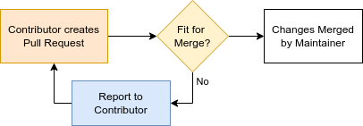

# Contributing Guide

These [instructions](https://contribute.cncf.io/maintainers/github/templates/required/contributing/#introduction) extend the sample contribution instructions from [CNCF](https://contribute.cncf.io/).

* [New Contributor Guide](#contributing-guide)
    * [Ways to Contribute](#ways-to-contribute)
    * [Find an Issue](#find-an-issue)
    * [Ask for Help](#ask-for-help)
    * [Pull Request Lifecycle](#pull-request-lifecycle)
    * [Development Environment Setup](#development-environment-setup)
    * [Pull Request Checklist](#pull-request-checklist)

Welcome! We are glad that you want to contribute to __cdxlr__! 📦+🔏=💌

As you get started, you are in the best position to give us feedback on areas of
our project that we need help with including:

* Problems found during setting up a new developer environment
* Gaps in our Quickstart Guide or documentation
* Bugs in our automation scripts

If anything doesn't make sense, or doesn't work when you run it, please open a
bug report and let us know!

## Ways to Contribute📦

We welcome many different types of contributions including:

* New features
* Builds, CI/CD
* Bug fixes
* Documentation
* Issue triage
* Web design
* Communications / Social Media / Blog Posts
* Release management

Not everything happens through a GitHub pull request. Please [contact us](mailto:mathias.haimerl@innomotics.com) and let's
discuss how we can work together.

## Find an Issue

[Instructions](https://contribute.cncf.io/maintainers/github/templates/required/contributing/#find-an-issue)

We have good first issues for new contributors and help wanted issues suitable
for any contributor.

Sometimes there won’t be any issues with these labels. That’s ok! There is
likely still something for you to work on. If you want to contribute but you
don’t know where to start or can't find a suitable issue, you can implement additional features listed in the issues.

Once you see an issue that you'd like to work on, please post a comment saying
that you want to work on it. Something like "I want to work on this" is fine.

## Ask for Help

The best way to reach us with a question when contributing is to ask on the original github issue.

## Pull Request Lifecycle

## Development Environment Setup

We suggest development with [JetBrains GoLand](https://jetbrains.com/go/), but any [go](https://go.dev/)-compatible IDE will do.
We are working with go 1.19 with `GO111MODULE=on`.

We are using extensive `go test` unittests with differnt combinations of inputs. If you like to contribute better test 
or fuzzing tests, you are very welcome.

## Sign Your Commits with Developer's Certificate of Origin (DCO) 1.1
Licensing is important to open source projects. It provides some assurances that
the software will continue to be available based under the terms that the
author(s) desired. We require that contributors sign off on commits submitted to
our project's repositories. The [Developer Certificate of Origin (DCO)](https://probot.github.io/apps/dco/) is a way to certify that you wrote and
have the right to contribute the code you are submitting to the project.

You sign-off by adding the following to your commit messages. Your sign-off must
match the git user and email associated with the commit.

    This is my commit message

    Signed-off-by: Your Name <your.name@example.com>

Git has a `-s` command line option to do this automatically:

    git commit -s -m 'This is my commit message'

If you forgot to do this and have not yet pushed your changes to the remote
repository, you can amend your commit with the sign-off by running

    git commit --amend -s 

using your real name (no pseudonyms or anonymous contributions), you declare the
following:

    By making a contribution to this project, I certify that:

        (a) The contribution was created in whole or in part by me and I
            have the right to submit it under the open source license
            indicated in the file; or

        (b) The contribution is based upon previous work that, to the best
            of my knowledge, is covered under an appropriate open source
            license and I have the right under that license to submit that
            work with modifications, whether created in whole or in part
            by me, under the same open source license (unless I am
            permitted to submit under a different license), as indicated
            in the file; or

        (c) The contribution was provided directly to me by some other
            person who certified (a), (b) or (c) and I have not modified
            it.

        (d) I understand and agree that this project and the contribution
            are public and that a record of the contribution (including all
            personal information I submit with it, including my sign-off) is
            maintained indefinitely and may be redistributed consistent with
            this project or the open source license(s) involved.

## Pull Request Checklist

When you submit your pull request, or you push new commits to it, our automated
systems will run some checks on your new code. We require that your pull request
passes these checks, but we also have more criteria than just that before we can
accept and merge it. We recommend that you check the following things locally
before you submit your code:

* Make sure that you tested all paths of your code with reasonable tests and adjusted existing tests to your changes.
* Make sure you used the correct formats (linted everything using `go fmt` and so on).
* Try not to use large libraries to keep the binary small.
  * If you are adding libraries, please explicitly state this in your commit message and make sure the license is compatible with our [Apache 2.0 License](../LICENSE.txt).